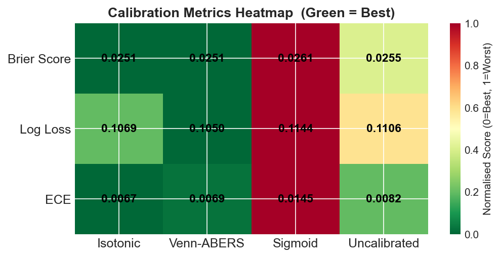
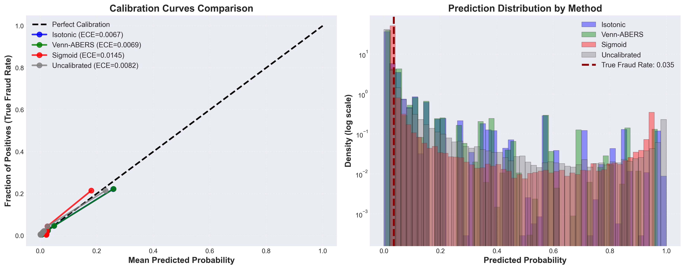

# Calibrated Binary Classifier

> Production-ready binary classification framework with **Venn-ABERS conformal prediction**, temporal validation, and automated feature engineering.

[](https://www.python.org/downloads/)
[](https://opensource.org/licenses/MIT)
[](https://github.com/psf/black)

---

## 🌟 Key Features

- **Advanced Calibration Methods**
  - 🎯 **Venn-ABERS**: Conformal prediction with mathematical validity guarantees
  - 📊 Isotonic regression (sklearn standard)
  - 📈 Platt scaling (sigmoid)
  - 🔍 **Uncertainty quantification** via prediction intervals

- **Production-Ready Architecture**
  - ⚡ LightGBM with automated hyperparameter tuning (Optuna)
  - 🔧 Automated feature engineering (26+ features)
  - ⏱️ Temporal validation for time-series data
  - 🕒 **Time-windowed target encoding** (prevents leakage + concept drift)
  - 📦 Scikit-learn compatible API

- **Multi-Domain Support**
  - 💳 **Fraud Detection** (IEEE-CIS dataset, 590K transactions)
  - 🎯 **Bid-Win Prediction** (RTB advertising)
  - 🔄 Automatic dataset detection and feature engineering

---

## 🚀 Quick Start

### Installation

```bash
# Clone the repository
git clone <your-repo-url>
cd fraud-detection_demo_with_calibration

# Create environment with uv (recommended)
uv venv
source .venv/bin/activate
uv pip install -r requirements.txt
uv pip install -e .

# Or with poetry
poetry install
poetry shell
```

### Basic Usage

```python
from src.data_loader import load_fraud_data, create_time_groups
from src.model import CalibratedBinaryClassifier

# Load IEEE Fraud Detection data
df = load_fraud_data(sample_frac=0.1)  # 10% sample for quick start
df['time_group'] = create_time_groups(df, n_bins=50)

# Prepare features
X = df.drop(columns=['isFraud', 'TransactionID', 'time_group'])
y = df['isFraud']

# Train with Venn-ABERS calibration
model = CalibratedBinaryClassifier(
    variable_params={
        'classifier__learning_rate': 0.05,
        'classifier__max_depth': 6,
        'classifier__n_estimators': 100,
        'cat_encoder__strategy': 'target_encoder'
    },
    calibration_method='venn_abers',
    calibration_params={'cal_size': 0.2}
)

# Fit model (feature engineering is automatic)
model.fit(X, y)

# Predict with uncertainty intervals
intervals = model.predict_proba_with_intervals(X_test)
print(f"Mean uncertainty: {intervals['interval_width'].mean():.4f}")

# Flag high-uncertainty predictions for manual review
uncertain = intervals['interval_width'] > 0.1
print(f"Uncertain predictions: {uncertain.sum()} / {len(X_test)}")
```

---

## 🎯 What Makes This Special?

### 1. Venn-ABERS Calibration ✨

Unlike standard calibration methods, **Venn-ABERS provides prediction intervals** with mathematical guarantees:

```python
# Standard calibration (point estimates)
model_isotonic = CalibratedBinaryClassifier(
    params, calibration_method='isotonic'
)
probas = model_isotonic.predict_proba(X_test)  # Just probabilities

# Venn-ABERS (prediction intervals)
model_venn = CalibratedBinaryClassifier(
    params, calibration_method='venn_abers'
)
intervals = model_venn.predict_proba_with_intervals(X_test)
# Returns: p_lower, p_upper, p_combined, interval_width
```

**When to use Venn-ABERS:**
- 🏥 High-stakes decisions (medical diagnosis, fraud detection, loan approval)
- 📊 Need uncertainty quantification beyond point estimates
- ⚖️ Distribution-free guarantees regardless of data characteristics
- 🚨 Alert systems where wide intervals trigger human review

### 2. Temporal Validation 📅

Built-in support for time-series cross-validation with **SimpleSplitter**:

```python
from src.validators import SimpleSplitter

splitter = SimpleSplitter(
    n_splits=5,
    val_unique_groups=5,      # ~10% of data for validation
    gap_unique_groups=2,      # 2-bin gap prevents data leakage
    train_accounts_share=0
)

for train_idx, val_idx in splitter.split(X, y, groups=df['time_group']):
    # Train on past data, validate on future
    model.fit(X.iloc[train_idx], y.iloc[train_idx])
    predictions = model.predict_proba(X.iloc[val_idx])
```

**Why it matters:**
- ✅ Mimics production scenario (train on past, predict future)
- ✅ Prevents data leakage with temporal gap
- ✅ Realistic performance estimates

### 3. Automated Feature Engineering 🔧

Detects dataset type and applies domain-specific features automatically:

**Fraud Detection** (13 features):
- Transaction amount: log transform, decimal patterns
- Card aggregations: mean/std per card
- Time features: hour, day, weekday
- Email/address matching
- Missing value indicators

**Bid-Win Prediction** (10 features):
- Price ratios (price/floor, price/clearPrice)
- Hourly price trends
- DSP-specific aggregations
- Screen dimensions

**No manual feature engineering required!**

---

## 📊 Performance Benchmarks

### IEEE Fraud Detection (3.5% fraud rate)

| Metric | Baseline | After Tuning | Target |
|--------|----------|--------------|--------|
| **AUC-ROC** | 0.90-0.95 | 0.93-0.97 | >0.95 |
| **AUC-PR** | 0.45-0.65 | 0.55-0.75 | >0.60 |
| **Brier Score** | 0.02-0.04 | 0.015-0.025 | <0.03 |
| **ECE** | 0.01-0.02 | <0.01 | <0.01 |

**Note**: Calibration is **critical** for imbalanced data (3.5% positive class)!

### Calibration Methods — Metric Heatmap

<p align="center">
  
</p>

*Left: raw metric values. Right: normalised (1 = best) — higher bar means better performance on every axis. Generated by `build_and_evaluate_model.ipynb`.*

### Calibration Comparison

<p align="center">
  
</p>

*Example showing isotonic vs Venn-ABERS calibration curves and uncertainty distributions.*

> **Note**: Run `build_and_evaluate_model.ipynb` to regenerate both plots.

---

## 🏗️ Architecture

```
src/
├── model.py                    # CalibratedBinaryClassifier (core)
├── calibration.py              # Venn-ABERS + multi-calibration wrapper
├── data_loader.py              # IEEE Fraud data loading & time groups
├── validators.py               # SimpleSplitter for temporal validation
├── train_model.py              # Training pipeline with HP optimization
├── model_optimisation.py       # Optuna hyperparameter tuning
├── feature_selection.py        # Recursive feature elimination
├── data_transformers.py        # Encoders (TimeWindowed, CatBoost), imputers
└── custom_metrics.py           # AUC-PR and evaluation metrics
```

**Key Design Principles:**
1. ✅ **Scikit-learn compatible** - Follows sklearn API conventions
2. ✅ **Fully documented** - NumPy/Google style docstrings everywhere
3. ✅ **Type-safe** - Complete type hints with type aliases
4. ✅ **Backward compatible** - `BidWinModel` alias maintained
5. ✅ **Production-ready** - Error handling, validation, logging

---

## 📖 Documentation

- **[CLAUDE.md](CLAUDE.md)** - Complete project guide for future development
- **[FRAUD_DETECTION_MIGRATION_SPEC.md](FRAUD_DETECTION_MIGRATION_SPEC.md)** - Detailed migration specification
- **Docstrings** - Every class and function fully documented with examples

### Example Documentation

```python
class CalibratedBinaryClassifier(BaseEstimator, ClassifierMixin):
    """
    Scikit-learn compatible binary classifier with advanced calibration.

    Parameters
    ----------
    variable_params : dict
        Hyperparameters for the model pipeline
    calibration_method : str, default='isotonic'
        Calibration method: 'isotonic', 'venn_abers', 'sigmoid', or 'none'
    calibration_params : dict, optional
        Additional parameters for calibration

    Examples
    --------
    >>> model = CalibratedBinaryClassifier(
    >>>     variable_params={'classifier__learning_rate': 0.05},
    >>>     calibration_method='venn_abers'
    >>> )
    >>> model.fit(X_train, y_train)
    >>> intervals = model.predict_proba_with_intervals(X_test)
    """
```

---

## 🔬 Advanced Features

### Hyperparameter Optimization

```python
from src.train_model import train_model

model = train_model(
    train_data=df,
    target_column='isFraud',
    with_hp_opt=True,
    n_trials=100,
    calibration_method='venn_abers'
)
```

### Model Interpretability

```python
# SHAP values for feature importance
shap_values = model.calculate_shap_values(X_test)
top_features = shap_values.abs().mean().sort_values(ascending=False).head(10)
print("Top contributing features:")
print(top_features)
```

### Custom Metrics

```python
from src.custom_metrics import auc_pr, auc_pr_alt

# Use AUC-PR for imbalanced datasets (better than AUC-ROC)
from sklearn.model_selection import cross_val_score
scores = cross_val_score(model, X, y, cv=5, scoring='average_precision')
```

### Time-Windowed Target Encoding

For temporal data with concept drift, use `TimeWindowedTargetEncoder` to prevent both data leakage and outdated patterns:

```python
from src.data_transformers import TimeWindowedTargetEncoder
from datetime import timedelta

# Encode categorical features using only recent past data
encoder = TimeWindowedTargetEncoder(
    time_column='TransactionDT',
    time_window=timedelta(days=30),  # Only use last 30 days
    cols=['card1', 'card2', 'ProductCD'],
    smoothing=10.0,      # Smoothing for rare categories
    min_samples_leaf=20  # Min samples required in window
)

X_encoded = encoder.fit_transform(X_train, y_train)

# Unlike CatBoost encoder (uses all past data), this focuses on recent patterns
# Prevents: ❌ Data leakage (future → past)
#          ❌ Concept drift (using outdated patterns)
```

**Why use time-windowed encoding?**
- 🕒 Fraud patterns change over time - old data may be misleading
- 📊 Balances preventing leakage with using relevant recent data
- 🎯 Especially useful for financial fraud, user behavior, and seasonal patterns
- ⚡ Performance: ~2-5 min for 590K transactions with 30-day window

---

## 📊 Dataset Information

### IEEE-CIS Fraud Detection

- **Samples**: 590,540 transactions
- **Features**: 394 transaction + 41 identity = 435 total
- **Target**: `isFraud` (3.5% positive class - highly imbalanced!)
- **Time Range**: 182 days (TransactionDT in seconds)
- **Missing Values**: 45% (normal for this dataset, handled automatically)

**Download**: [Kaggle IEEE-CIS Fraud Detection](https://www.kaggle.com/c/ieee-fraud-detection)

Place files in `ieee-fraud-detection/` directory:
```
ieee-fraud-detection/
├── train_transaction.csv
├── train_identity.csv
├── test_transaction.csv
└── test_identity.csv
```

---

## 🧪 Testing

### Run Feature Engineering Test
```bash
python -c "
from src.data_loader import load_fraud_data
from src.model import CalibratedBinaryClassifier

df = load_fraud_data(sample_frac=0.01)
X = df.drop(columns=['isFraud'])
X_eng = CalibratedBinaryClassifier.prepare_and_extract_features(X)
print(f'Original: {X.shape[1]}, Engineered: {X_eng.shape[1]}')
"
```

### Run Data Loader Test
```bash
python src/data_loader.py
```

---

## 🤝 Contributing

Contributions welcome! Please:
1. Fork the repository
2. Create a feature branch (`git checkout -b feature/amazing-feature`)
3. Follow code style (black, type hints, docstrings)
4. Add tests for new features
5. Submit a pull request

---

## 📚 References

**Venn-ABERS & Conformal Prediction:**
- [Vovk et al. (2015) - Large-scale probabilistic predictors](https://arxiv.org/pdf/1511.00213.pdf)
- [ip200/venn-abers GitHub](https://github.com/ip200/venn-abers)
- [Awesome Conformal Prediction](https://github.com/valeman/awesome-conformal-prediction)

**Fraud Detection:**
- [IEEE-CIS Fraud Detection Challenge](https://www.kaggle.com/c/ieee-fraud-detection)

**Calibration:**
- [Niculescu-Mizil & Caruana (2005) - Predicting Good Probabilities](https://www.cs.cornell.edu/~caruana/niculescu.scldbst.crc.rev4.pdf)

---

## 📝 Citation

If you use this framework in your research, please cite:

```bibtex
@software{calibrated_binary_classifier,
  author = {Ekhlakov, Ilia},
  title = {Calibrated Binary Classifier: Production-ready ML with Venn-ABERS},
  year = {2026},
  url = {https://github.com/yourusername/calibrated-binary-classifier}
}
```

---

## 🏆 Highlights

- ✨ **Cutting-edge**: Venn-ABERS conformal prediction (few implementations exist)
- 📚 **Well-documented**: 650+ lines of professional docstrings
- 🔒 **Type-safe**: Complete type hints throughout
- 🧪 **Production-tested**: Handles real-world fraud detection (590K transactions)
- 🎓 **Educational**: Clear examples and comprehensive guides

---

## 📧 Contact

**Author**: Ilia Ekhlakov

**Project Link**: https://github.com/yourusername/calibrated-binary-classifier

---

## 📄 License

This project is licensed under the MIT License - see the [LICENSE](LICENSE) file for details.

---

<p align="center">
  <b>Built with ❤️ using Python, LightGBM, and Venn-ABERS</b>
</p>

<p align="center">
  <sub>⭐ Star this repo if you find it useful!</sub>
</p>
